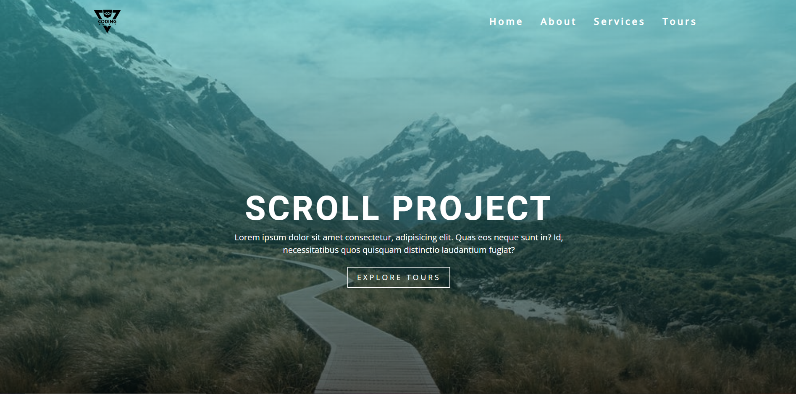
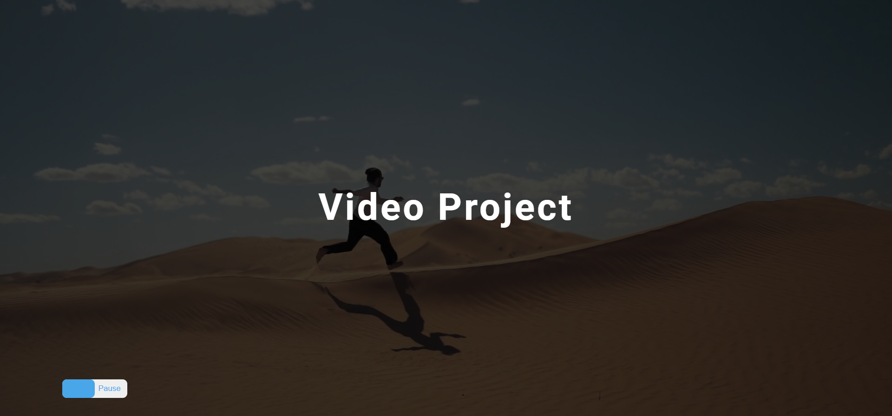

## Language/concept/topic

So for scroll project basically i developed a landing page with a scroll feature which can even be implementated using bootstrap but due to some quick revision of JS and DOM i have made this project.

Talking about anthor project it is just a background video which can be used as landing page's hero section.

- [scroll](https://github.com/jay-2000/jsMiniProjects/tree/main/scroll)

- [video](https://github.com/jay-2000/jsMiniProjects/tree/main/video)

### Key takeaways

I got to learn new DOM methods and some quick revision for DOM known methods.

Respect++ & Huge Shout outs to those who have completed their 100 days of code challenge.

If you are reading this blog and made it this far, THANK YOU SO MUCH for taking out the time to read my blog. Have a Great day.

Peace!