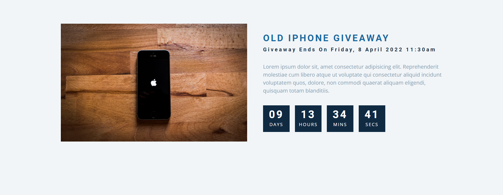

Finally Went to college and attended all lecture after long time started practice core dom enjoyed the day.

## Language/concept/topic

Using DOM i developed an web app for Tab in which section will be divided as tabs of browser.

And another one is Countdown-timer so by name this mini project is clear that it is a countdown app which will run on parameter of timer.

- [link to code For Tab](https://github.com/jay-2000/jsMiniProjects/tree/main/tabs)

- [link to code](https://github.com/jay-2000/jsMiniProjects/tree/main/countdown-timer)

### Key takeaways

I got to learn Core DOM cncepts and revised some known concepts.

Respect++ & Huge Shout outs to those who have completed their 100 days of code challenge.

If you are reading this blog and made it this far, THANK YOU SO MUCH for taking out the time to read my blog. Have a Great day.

Peace!