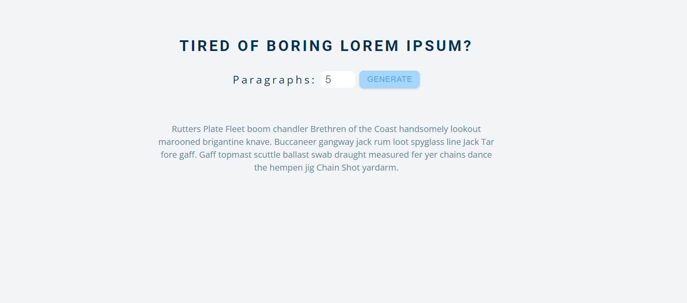

Hola Folks, learned some new and interesting stuff for now pace of learning python have been slow down but increased the pace of vanilla JS projects.

## Language/concept/topic

So, basically I have developed a website in which we can generate random text i.e. Lorem Ipsom ,so that it can be used for specific requirements.

- [link to code](https://github.com/jay-2000/jsMiniProjects/tree/main/lorem%20ipsom)

### Key takeaways

I got to learn some concepts of vanilla js.

Respect++ & Huge Shout outs to those who have completed their 100 days of code challenge.

If you are reading this blog and made it this far, THANK YOU SO MUCH for taking out the time to read my blog. Have a Great day.

Peace!