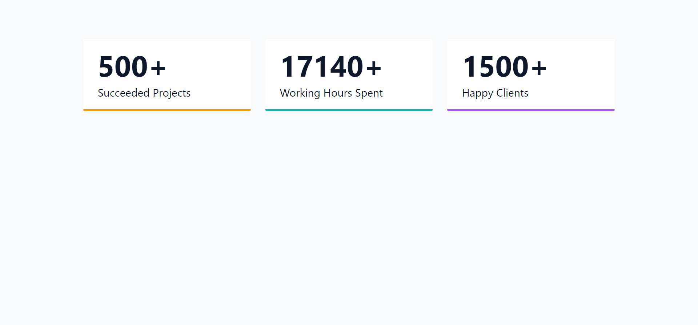

This sunday was pretty busy writing assignments.

## Language/concept/topic

what and how i did the stuff.

- [link to code](https://github.com/jay-2000/jsMiniProjects/tree/main/numbers)

### Key takeaways

I got to learn -------.

Respect++ & Huge Shout outs to those who have completed their 100 days of code challenge.

If you are reading this blog and made it this far, THANK YOU SO MUCH for taking out the time to read my blog. Have a Great day.

Peace!