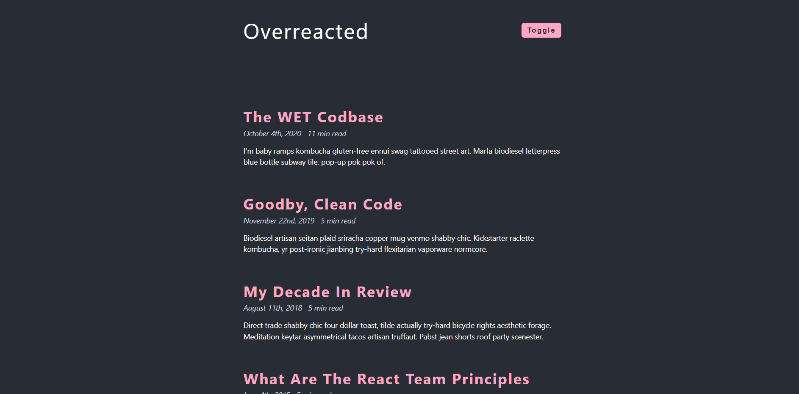

Day spent well with writingg assignments and completing journals.

## Language/concept/topic

So with the help of toggle button the dark mode can be switch into light and dark theme.

- [link to code](https://github.com/jay-2000/jsMiniProjects/tree/main/dark-mode)

### Key takeaways

I got to learn Dom elements and manymore.

Respect++ & Huge Shout outs to those who have completed their 100 days of code challenge.

If you are reading this blog and made it this far, THANK YOU SO MUCH for taking out the time to read my blog. Have a Great day.

Peace!