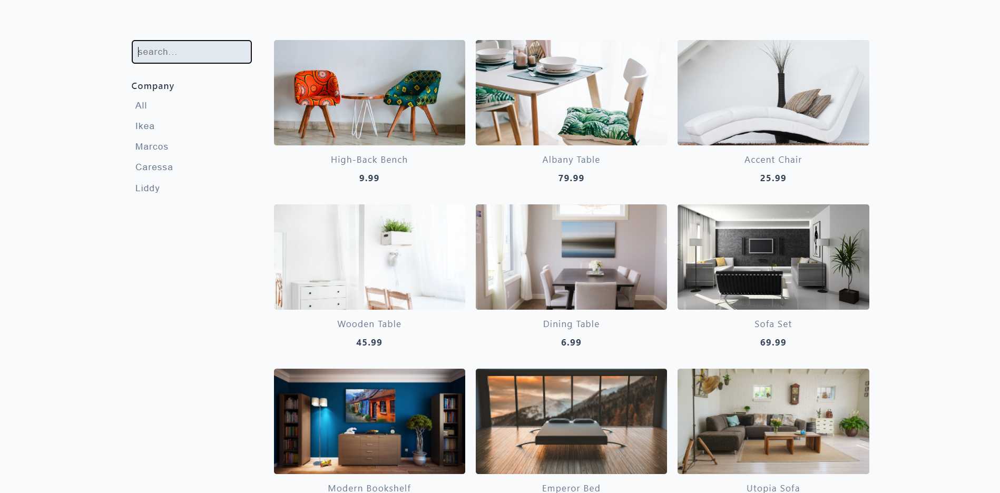

Temperature is very high nowadays and deadline for journal submission is near and spent mmy day in completing it.

## Language/concept/topic

You can search the key words for the product so that it can be search and gives the required result.

- [link to code](https://github.com/jay-2000/jsMiniProjects/tree/main/filters)

### Key takeaways

I got to learn some DOM concepts and quick revision.

Respect++ & Huge Shout outs to those who have completed their 100 days of code challenge.

If you are reading this blog and made it this far, THANK YOU SO MUCH for taking out the time to read my blog. Have a Great day.

Peace!