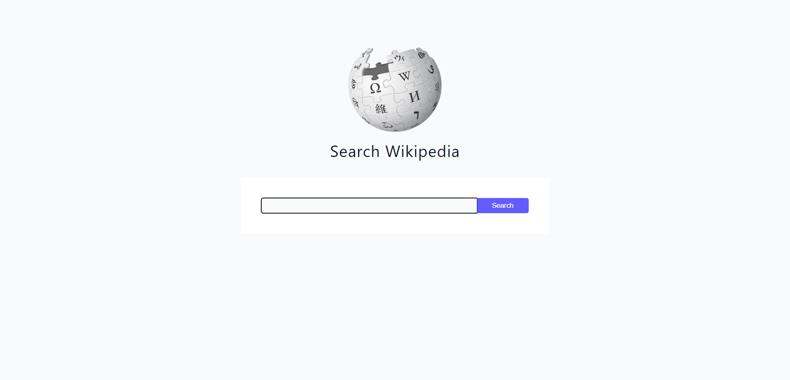
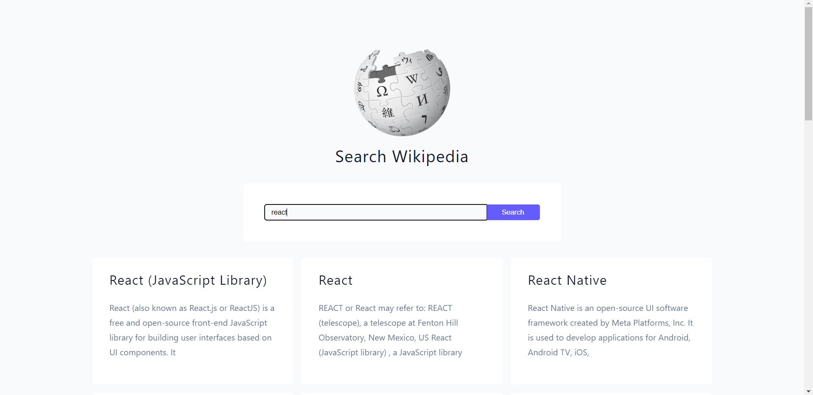

## Language/concept/topic

so Basically we can make search on specific topic and the results will be shown on this website which will redirect to wikipedia.

- [link to code](https://github.com/jay-2000/jsMiniProjects/tree/main/wikipedia)

### Key takeaways

I got to learn some new concepts and quick revision.

Respect++ & Huge Shout outs to those who have completed their 100 days of code challenge.

If you are reading this blog and made it this far, THANK YOU SO MUCH for taking out the time to read my blog. Have a Great day.

Peace!