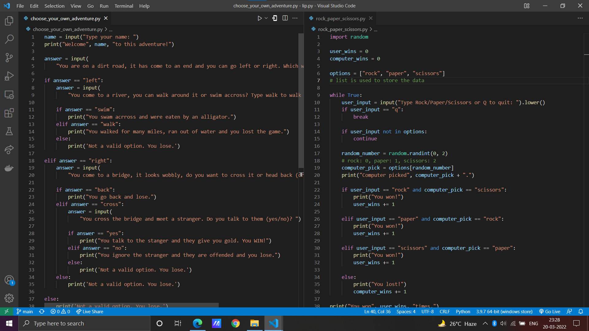

well Today was very sunny day and enjoyed alot by learning python.

## Language/concept/topic

so, Basically I have made a rock-paper-scissors game and an adventure game.

- [choose your own adventure](https://github.com/jay-2000/lip.py/blob/main/choose_your_own_adventure.py)

- [rock paper scissors](https://github.com/jay-2000/lip.py/blob/main/rock_paper_scissors.py)

### Key takeaways

I got to learn and revised new things as well as concepts. elif, random module, while loop, basic use of list, break & continue keywords.

Respect++ & Huge Shout outs to those who have completed their 100 days of code challenge.

If you are reading this blog and made it this far, THANK YOU SO MUCH for taking out the time to read my blog. Have a Great day.

Peace!