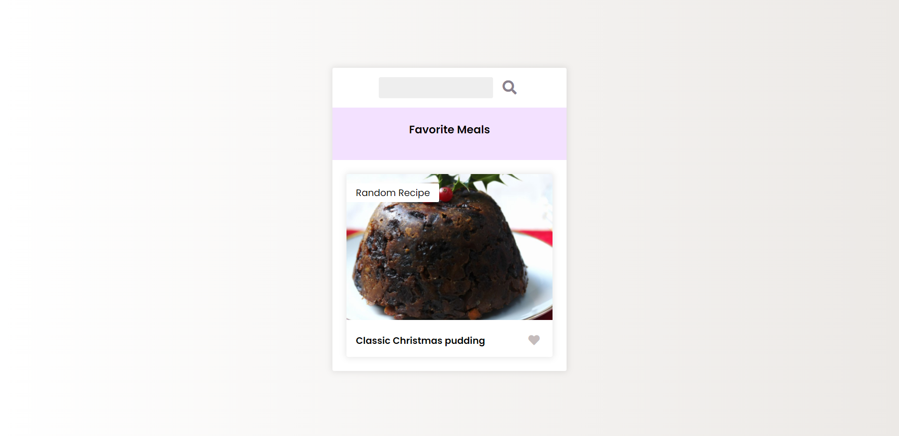

## Language/concept/topic

Basically a website in which a random recipes are generated on reloading the pages or either one can search it and if its available it will surely show out.

- [link to code](https://github.com/jay-2000/jsMiniProjects/tree/main/recipe-app)

### Key takeaways

I got to learn some dom and api concepts.

Respect++ & Huge Shout outs to those who have completed their 100 days of code challenge.

If you are reading this blog and made it this far, THANK YOU SO MUCH for taking out the time to read my blog. Have a Great day.

Peace!