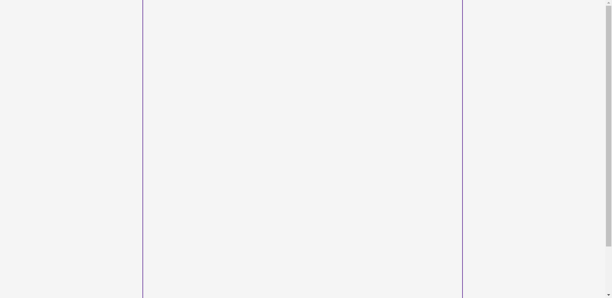
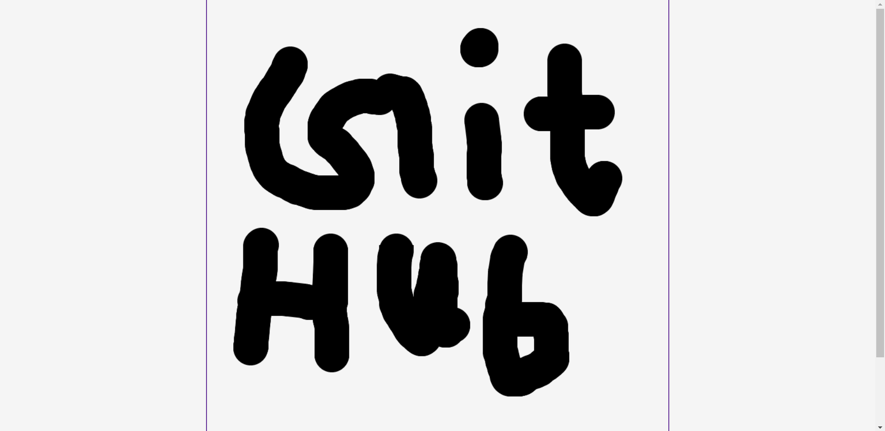

## Language/concept/topic

Simple drawing webapp with the help of cursors.it is made using canvas module.

- [link to code](https://github.com/jay-2000/jsMiniProjects/tree/main/drawing-app)

### Key takeaways

I got to learn some canvas properties in JavaScript.

Respect++ & Huge Shout outs to those who have completed their 100 days of code challenge.

If you are reading this blog and made it this far, THANK YOU SO MUCH for taking out the time to read my blog. Have a Great day.

Peace!