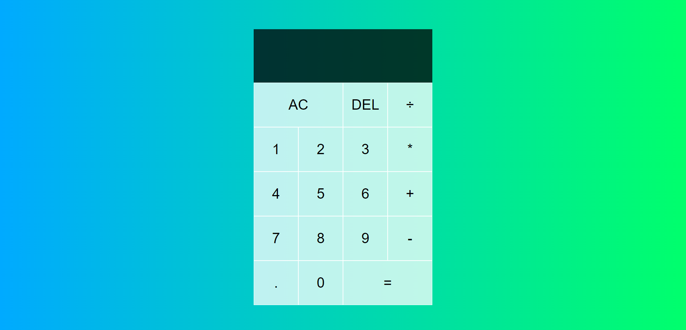

## Language/concept/topic

with the help of JavaScript (ES6) i have developed this calculator which can perform all the basic operation which a normal calculator can perform.

- [link to code](https://github.com/jay-2000/jsMiniProjects/tree/main/calculator)

### Key takeaways

I got to learn ES6 concepts.

Respect++ & Huge Shout outs to those who have completed their 100 days of code challenge.

If you are reading this blog and made it this far, THANK YOU SO MUCH for taking out the time to read my blog. Have a Great day.

Peace!