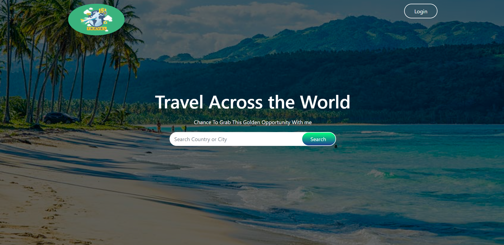
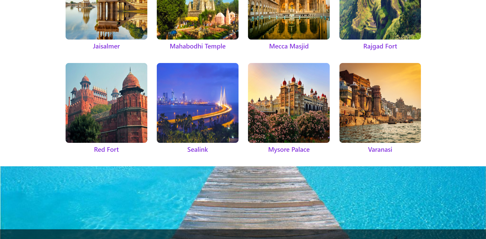

## Language/concept/topic

A responsive tourism webiste UI with the help of HTML, CSS ,and some js. Basically I have used bootstrap for  responsiveness.

- [link to code](https://github.com/jay-2000/jsMiniProjects/tree/main/tourism)

### Key takeaways

I got to learn js concepts some quick revision of CSS and bootstrap4.

Respect++ & Huge Shout outs to those who have completed their 100 days of code challenge.

If you are reading this blog and made it this far, THANK YOU SO MUCH for taking out the time to read my blog. Have a Great day.

Peace!