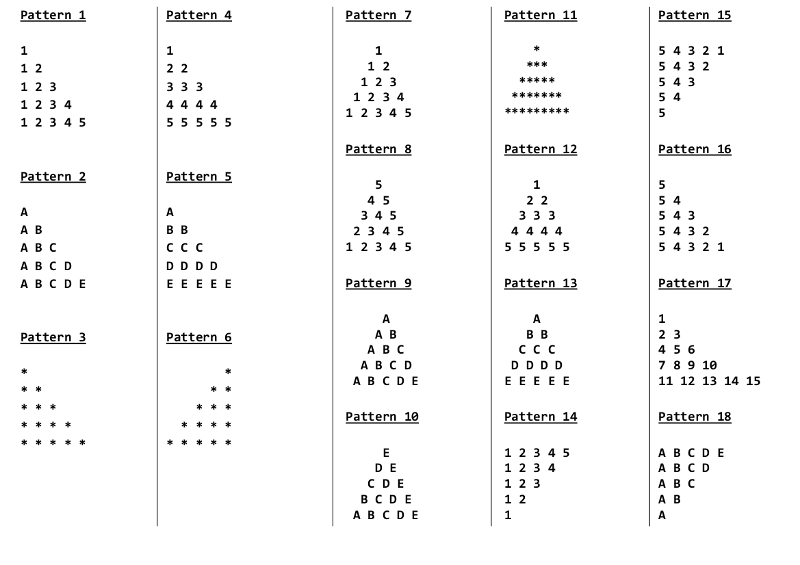

My today's day was pretty cool start with workout and then after getting ready for started i started with some random youtube tutorial where i learned about how to make QRcode in python with just 10 lines of code which was pretty cool.

## Language/concept/topic

Pattern program is something which is more often asked in interview, since it improvess the logic for it and moreover it helps to know how use loops and nested loops according to the requirement.

- [link to code](https://github.com/jay-2000/lip.py/tree/main/pattern)

- [link to code](https://github.com/jay-2000/lip.py/blob/main/qrcode.py)

### Key takeaways

I got to learn about how patter program works and how to code and even if you get stuck you can still figure out since its not that hard which i use to consider. also got to learn qrcode module which was pretty amazing

Respect++ & Huge Shout outs to those who have completed their 100 days of code challenge.

If you are reading this blog and made it this far, THANK YOU SO MUCH for taking out the time to read my blog. Have a Great day.

Peace!