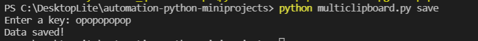

Today I was very happy since i received my DEV hackathon participant badge as well as few dollars credits to buy some DEV sticker goodies, as a token of appreciation for a successful submission as a participant.so TODAY I FELT LIKE TO DO SOME DEVELOPMENT RATHER THAN SOLVING A CODING PROBLEM.

## Multi-clipboard

With the help of different modules in python , I created a mini-project which helps to save data in json as a clipboard.for now the delete feature is not yet included but soon it can be so stay tune.

- [link to code](https://github.com/jay-2000/automation-python-miniprojects/blob/main/multiclipboard.py)

### Key takeaways

I got to learn modules like clipboard modules, system modules(sys) and one of the important one in development i.e. JSON module .

Respect++ & Huge Shout outs to those who have completed their 100 days of code challenge.

If you are reading this blog and made it this far, THANK YOU SO MUCH for taking out the time to read my blog. Have a Great day.

Peace!